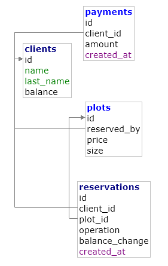

## MarsReservation - rezerwacja działek na marsie

Blazej Turczynowicz  
Projekt do zarządzania sprzedaża rezerwacji działek na marsie.

- **Technologie backend:** Node.js (Express), PostgreSQL, ORM `sequlize`.
- **Technologie frontend:** Next.js - React, komponenty Shadcn.

---

## Schemat bazy

## Implementacja

Kod znajduje sie w katalogu `sql`.

### Tabele (Modele danych)

- **`clients`**: Dane klientow.
- **`plots`**: Rejestr gruntów.
- **`reservations`**: Zmian rezerwacji - nowe rezerwacje oraz zmiany statusu.
- **`payments`**: System platnosci.

### Procedury

- **`p_reserve`**: Rezerwuje dzialke.
- **`p_remove_reservation`**: Usuwa rezerwacje dzialki.

### Widoki

- **`v_available_plots`**: Widok tylko wolnych gruntów
- **`v_client_summary`**: Podsumowanie klienta

### Triggery

- **`trg_plot_reserved`**: Zmienia stan rezerwacji dzialki po pojawieniu sie zmiany w `reservations`.
- **`trg_client_balance`**: Aktualizuje posiadane srodki na koncie klienta po zmianie w systemie platnosci `payments`.
- **`trg_update_payments`**: Aktualizuje posiadane srodki na koncie klienta po zmianie w systemie platnosci `payments`.

### Funkcje

- **`fn_plots_sold_between`**: Raport sprzedazy rezerwacji w danym przedziale dat.

---

## Uruchomienie

- Start kontener docker - `docker-compose up -d`
- Przeprowadz inicjalizacje bazy korzystajac z sequlize:
  1.  `npm install`
  2.  `npm run db:migrate`
- Urochomienie serwera - `npm start` - port defaultowy `3000`

---

## Komunikacja z serwerem - endpointy

| Metoda   | Endpoint                       | Opis                                                | Body                       |
| -------- | ------------------------------ | --------------------------------------------------- | -------------------------- |
| **GET**  | `api/clients`                  | Pobiera listę wszystkich klientów.                  | brak                       |
| **GET**  | `api/client-summary/:clientId` | Pobiera widok podsumowania dla konkretnego klienta. | `:clientId` (w URL)        |
| **GET**  | `api/plots`                    | Pobiera listę wszystkich dostępnych parceli.        | brak                       |
| **POST** | `api/reserve`                  | Wywołuje procedurę rezerwacji działki.              | `{ "clientId", "plotId" }` |
| **POST** | `api/remove-reservation`       | Wywołuje procedurę usunięcia rezerwacji.            | `{ "clientId", "plotId" }` |
| **POST** | `api/add-client`               | Tworzy i zapisuje nowego klienta w bazie.           | `{ "name", "lastName" }`   |
